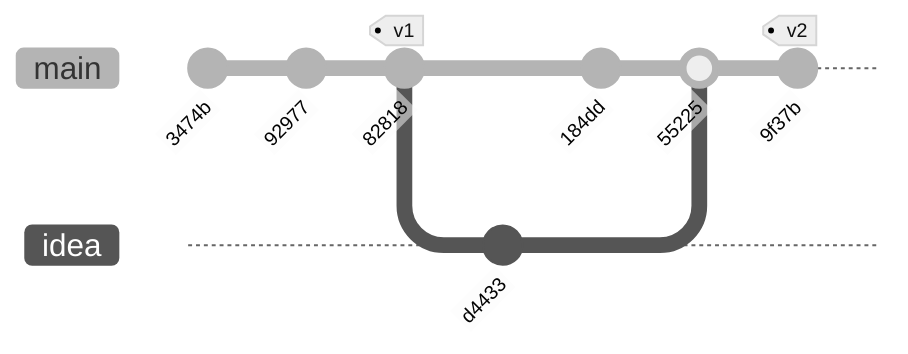

Git is an incredibly powerful version control tool and I'm of the impression that knowing how Git works under the hood demystifies the tricks that you can pull off to fix an issue.
## The `.git` Directory
In the `.git` directory, there's two significant files:
1. `.git/index` - a binary file that stores information about paths and the SHA1 of the blob object. It also includes information like the permission of the file.
2. `.git/HEAD` - a text file that stores a reference to where the HEAD pointer points to. 

There's also some directories:

3. `.git/refs/` - a directory that has three subdirectories. These all ultimately are **ref**erences to objects.
	1. `refs/tags/` for tags.
	2. `refs/heads/` for branches.
	3. `refs/remotes/` for remote repos.
4. `.git/objects/` - a directory that holds blob objects, which are fundamentally just pieces of data. These can be files, commits, or anything else that git uses. This is essentially a hashmap where the value is a blob.

## Git Plumbing
Commonly used commands, like `git add` or `git remote` are polished interfaces for interacting with Git. These use "plumbing" commands, like `git rev-parse` or `git hash-object` to interact with data in the `.git/` directory. We can actually use these tools to understand how Git works a bit better. 

As an example, I've made a demo project with the following history:



HEAD in this case is at commit `9f37b`, and there's a tag on that same commit to mark it as "v2." We have a merge commit, two branches, and two tags. That should be enough to explore the "less pretty" commands (or the plumbing) that Git uses under the hood to enact changes when we use the higher-order commands.

### A Trail Head
If we take a look in the HEAD file, we see it's pointing to a reference.

```bash title="Contents .git/HEAD"
ref: refs/heads/main
```

If we look for *that* file, we see it's just a SHA1 hash.
```bash title="Contents of .git/refs/heads/main" 
9f37ba88a0dc7681da7b9861e86d5f237e0061ef
```

In fact, we'll see that pretty much everything in Git is referenced via a SHA1 hash. We can use some lower level commands to interrogate these hashes.
### The `cat-file` command
If we use the `cat-file` plumbing command, we can see the contents of the binary file at `.git/objects/9f/37ba88a0dc7681da7b9861e86d5f237e0061ef`.

```bash title="λ git cat-file -p 9f37ba88a0dc7681da7b9861e86d5f237e0061ef"
tree e13d0e8a0b1e8e63f6c6bc421f5c826710f79747
parent 55225948c8e46b2932476e4475166a9ffb063864
author Nicholas Osaka <me@nosaka.xyz> 1762408519 -0500
committer Nicholas Osaka <me@nosaka.xyz> 1762408519 -0500

v2!
```

We see two SHA1 hashes, author/committer information, and the commit message. Those two hashes are important. Clearly named, the "parent" hash refers to the commit object that precedes the commit. If all you're doing is `git add` and `git commit`, without any merges, the commit history will look linear and each commit will have one parent. However, you can merge two commits, and that creates a merge commit with two parent. There's no limit to the number of commits you can merge, but realistically you're unlikely to merge more than 2-3 commits at any time. There's also the "tree" hash, which represents the repository at the point in time of the commit:

```bash title="λ git cat-file -p e13d0e8a0b1e8e63f6c6bc421f5c826710f79747"
100644 blob 1996dd8a2d58021dd43f05bf353da6cb6c43072f	README.md
100644 blob 7482df902dc0352072364d698a9d0185391c2d6d	idea.txt
100644 blob fd8029b7a7ce79634a49ffa8ed8a96b44b11b889	one.txt
100644 blob d26cbf132f9df7bddbf2ced5c37dd72fe5e2f720	two.txt
```

Reading the table here, we see that we have several text files (blobs, to be more accurate) with `rw-r--r--` (644) permissions. You can even see the contents of the blob at that time by running `cat-file` again:

```bash title="λ git cat-file -p 7482df902dc0352072364d698a9d0185391c2d6d"
A new idea!
```

### The `rev-parse` command
The `cat-file` command is handy when you have a commit hash in hand. But Git is smart, and will accept what's called a *commitish*. A commitish will resolve to a full commit hash via the `rev-parse` command. Some examples of valid commitish for this demo include:

- Short commit hashes: `9f37ba8`,  `5522594`,  `184dd79`.
- Tags: `v1`,  `v2`.
- Branches: `main`, `idea`.
- Relative references: `HEAD`, `HEAD~2`, `HEAD^`

So for example, if I wanted to quickly get the commit associated with the v2 tag, I could run `git rev-parse v2`, which would resolve to `9f37ba88a0dc7681da7b9861e86d5f237e0061ef`. (If I wanted to get the short commit hash, I could use the "short" flag: `git rev-parse --short v2`, which returns `9f37ba8`.)

The `rev-parse` command is helpful for quickly resolving a more human-friendly name into something than can be passed into `cat-file`, for example.

